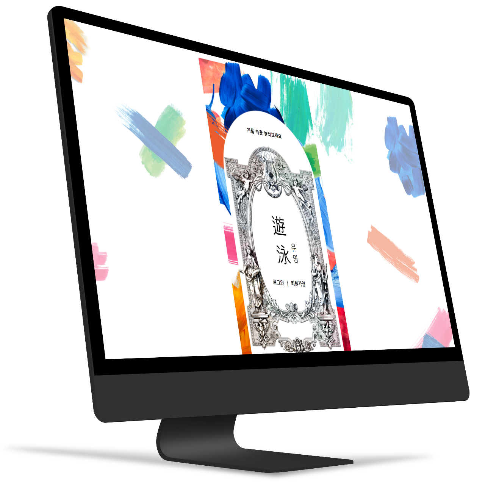
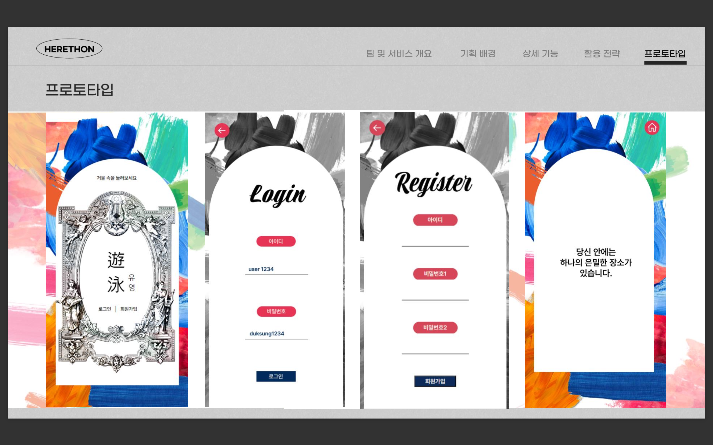
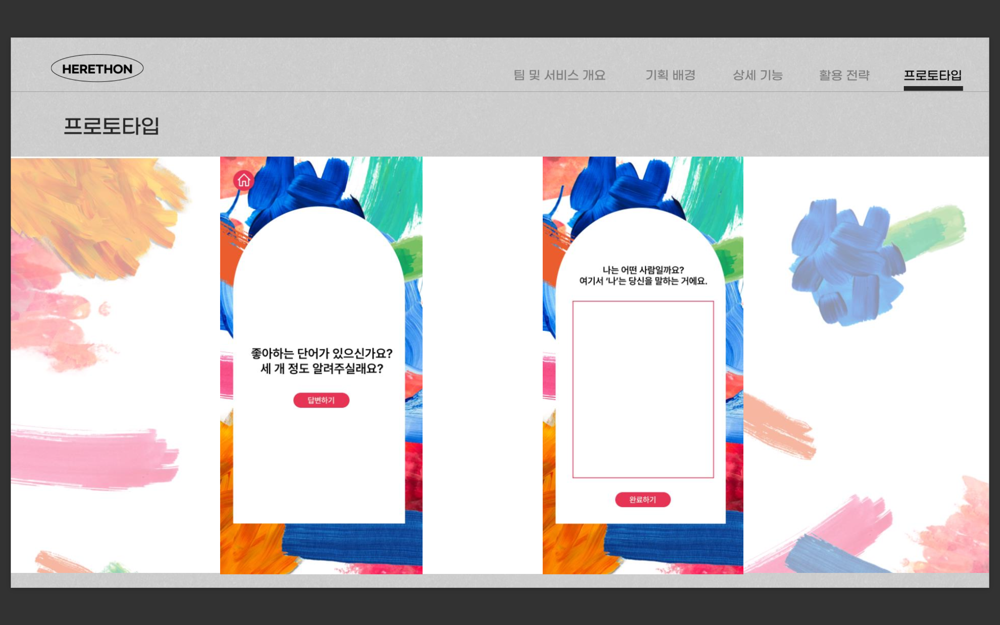
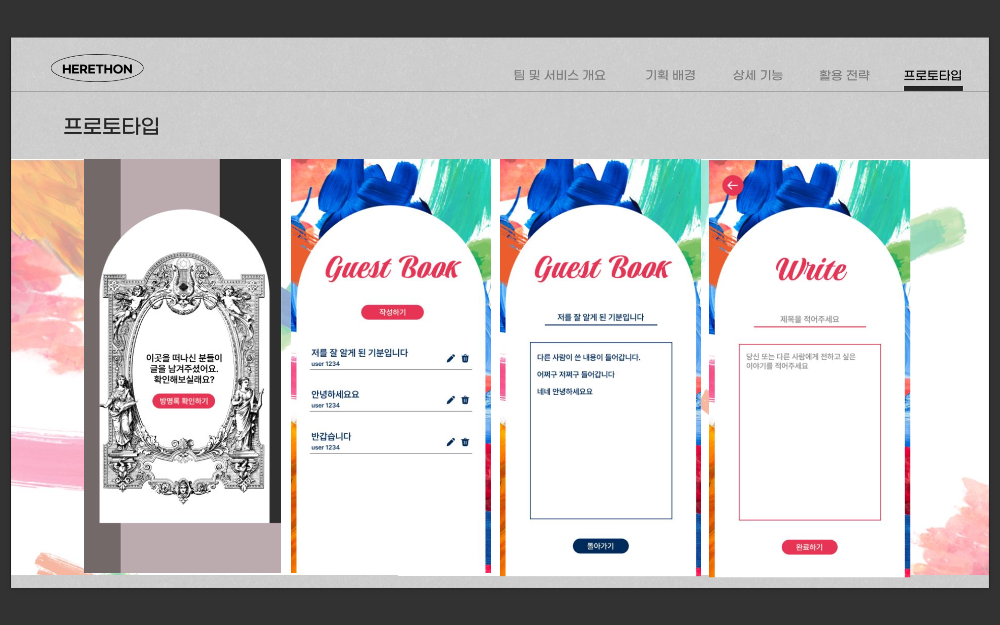

# 2023 여기톤 : HERETHON 12조

## 서비스 소개

#### 여성의 삶을 둘러싼 구조적, 문화적 원인에 의해 정신 건강 질환에 취약해진

#### 여성 대학생들에게 ‘자기반성이 아닌’ 자아 인식을 할 수 있도록 돕는 문답형 기록 웹 서비스 🌊유영🌊입니다.

#### 감각을 깨우고 집중하기, 인간 관계, 진로 및 목표, 완벽과 강박 등의 파트로 구성된 질문에 천천히 대답하다 보면 어느새 혼란은 잦아들고 ‘나’에 대해 더 잘 알아갈 수 있습니다.

#### 모든 질문에 답변을 마친 사용자들이 방명록을 통해 당신에게 위로의 말을 전하고 있을지도 모릅니다.

#### 천천히 하나씩 질문에 대답해보세요.



<br>

## 실행 방법
```
#가상환경 설치
python -m venv venv (Window)
virtualenv -p python3 venv (Mac)

#가상환경으로 들어가기
.\venv\Scripts\activate (Window)
source venv/bin/activate (Mac)

#장고설치
pip install django~=3.2.10 

#마이그레이션
python manage.py makemigrations
python manage.py migrate

#가상환경 실행
python manage.py runserver

#가상환경 종료
ctrl + c
```

<br>

## 팀원 소개

<table border="" cellspacing="0" cellpadding="0" width="100%">
  <tr width="100%">
    <td align="center">이성경</a></td>
    <td align="center">김가영</a></td>
    <td align="center">박소정</a></td>
    <td align="center">문수호</a></td>
    <td align="center">최유신</a></td>
  </tr>
  <tr width="100%">
  <td align="center"></td>
  <td  align="center"></td>
  <td  align="center"></td>
    <td  align="center"></td>
  <td  align="center"></td>
  </tr>
  <tr width="100%">
  <td  align="center">기획/디자인</td>
    <td  align="center">프론트엔드</td>
  <td  align="center">프론트엔드</td>
  <td  align="center">백엔드</td>
    <td  align="center">백엔드</td>
     </tr>
      <tr width="100%">
     </tr>
  </table>

<br>

## 기술 스택

<span>Front End :</span> 
<span></span>
<span></span>
<span></span>

<span>Back End: </span>
<span></span>
<span></span>

<span>Environment: </span>
<span></span>
<span></span>
<span></span>
<span></span>

<span>Communication: </span>
<span></span>
<span></span>

<span>Design: </span>
<span></span>

<br>

## 화면 구성






<br>

## API 명세서


<br>

## 폴더 구조

  ```
📂 all_project
└─yuyong
├─ yuyong
│  ├─ **init**.py
│  ├─ [asgi.py](http://asgi.py/)
│  ├─ [settings.py](http://settings.py/)
│  ├─ [urls.py](http://urls.py/)
│  └─ [wsgi.py](http://wsgi.py/)
├─ post
│  ├─ **init**.py
│  ├─ [admin.py](http://admin.py/)
│  ├─ [apps.py](http://apps.py/)
│  ├─ [models.py](http://models.py/)
│  ├─ [tests.py](http://tests.py/)
│  ├─ urls.py

│  ├─ forms.py

│  └─ [views.py](http://views.py/)

├─ qna
│  ├─ **init**.py
│  ├─ [admin.py](http://admin.py/)
│  ├─ [apps.py](http://apps.py/)
│  ├─ [models.py](http://models.py/)
│  ├─ [tests.py](http://tests.py/)
│  ├─ urls.py

│  ├─ forms.py

│  └─ [views.py](http://views.py/)

├─ user
│  ├─ **init**.py
│  ├─ [admin.py](http://admin.py/)
│  ├─ [apps.py](http://apps.py/)
│  ├─ [models.py](http://models.py/)
│  ├─ [tests.py](http://tests.py/)
│  ├─ urls.py

│  ├─ forms.py

│  └─ [views.py](http://views.py/)
└─ [manage.py](http://manage.py/)
  ```
